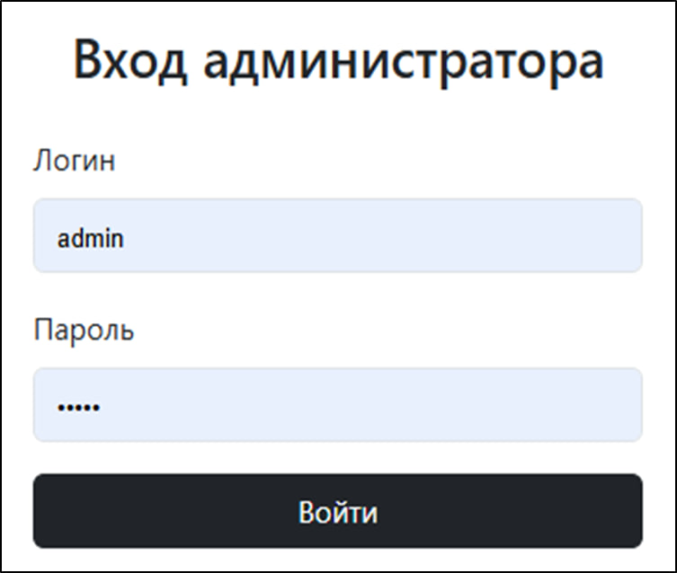
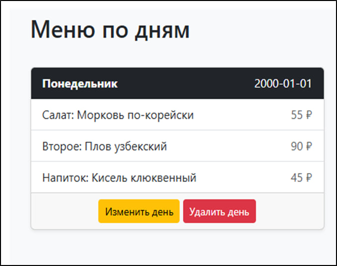
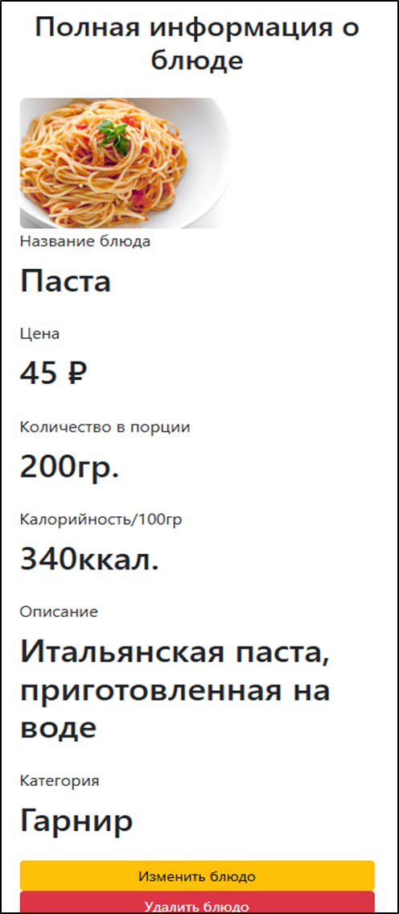
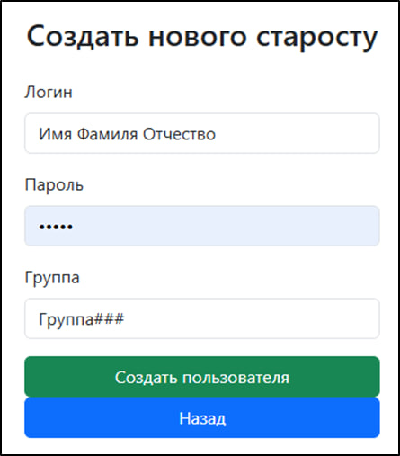
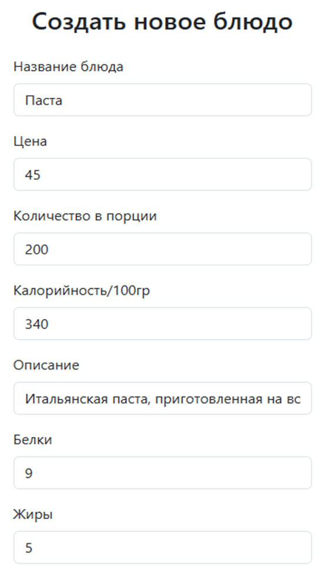
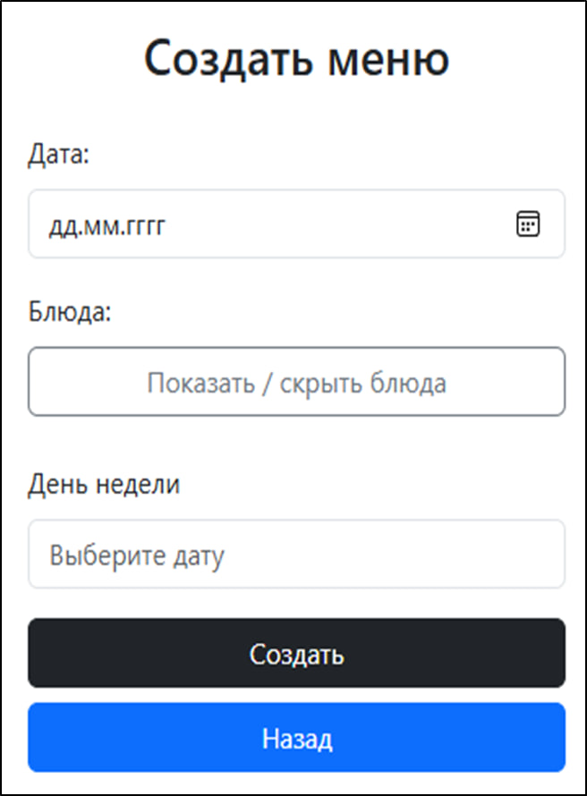
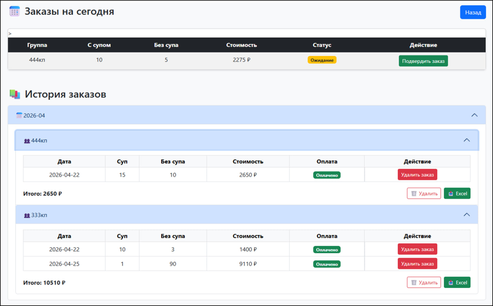

# 📚 Backend for canteen app
---

## ✨ Features

- JWT Authentication
- Create, update and delete daily dishes and menu
- Create, update and delete users for mobile app
- Confirm requests from users
- Change state of pay
- Browse daily dishes, menu and request history
  
---

## 🏗 Architecture

The backend is built using **Spring Boot** with layered architecture:

- **Controller** — REST API endpoints
- **Service** — business logic
- **Repository** — database access layer
- **Security Layer** — JWT authentication and authorization

### Layers responsibility

- **Controller** — handles HTTP requests and responses
- **Service** — processes application logic
- **Repository** — communicates with database
- **JWT Filter** — validates access tokens and authenticates users  

---

## 🛠 Tech Stack

**Language**
- Kotlin & HTML

**Database**
- Spring Data H2

**Backend**
- Spring Boot
- Spring Security
- JWT
- Rest Controllers

---

| Login | Main Screen | Details |
|------|----------|--------|
|  |  |  |

| User | Dish | Menu |
|---------|---------|--------|
|  |  |  | 

| Request screen |
|--------------|
|  | |

---
